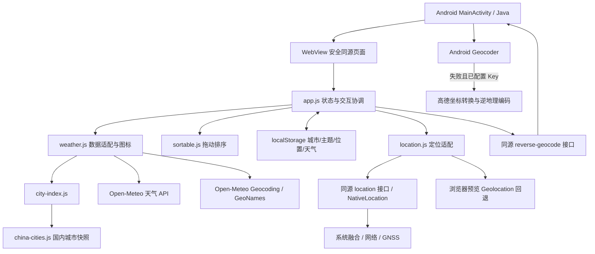
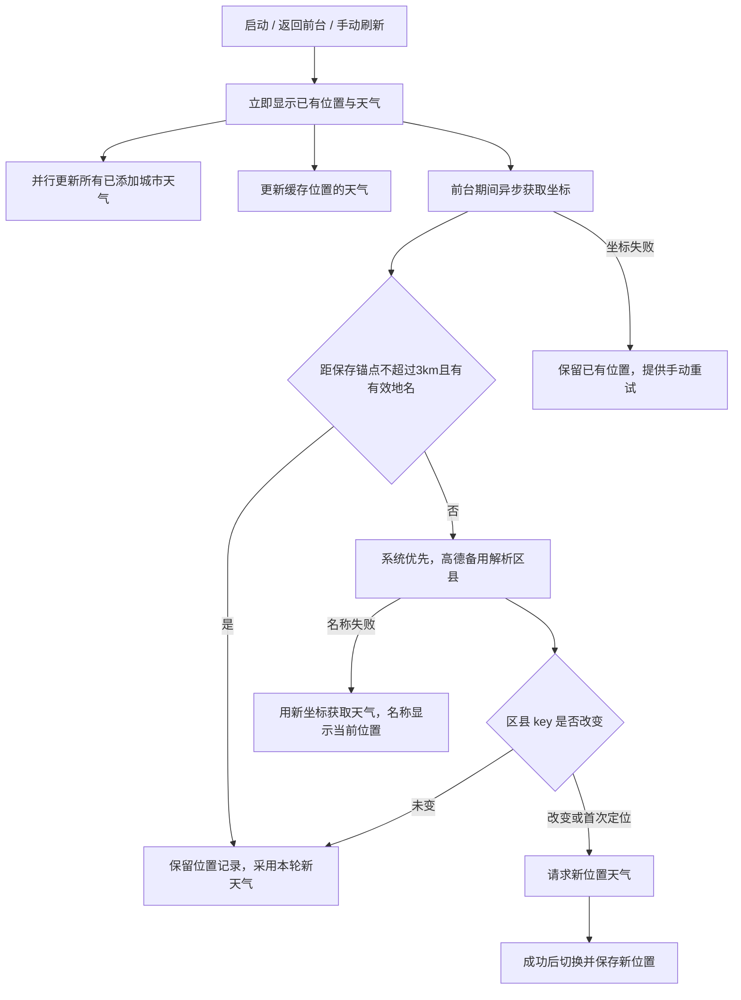

# 旅人天气 · Travel Weather 设计开发文档

| 项目 | 内容 |
| --- | --- |
| 文档对应版本 | 0.12（开发中） |
| 作者 | Leo Gorge（liu-gongjie） |
| 主要贡献者 | Codex（AI 协作开发） |
| 平台 | Android，最低 API 23，目标 API 35 |
| 包名 | `com.travelweather.app` |
| APK 版本 | versionName `0.12`，versionCode `17` |
| 技术栈 | Java WebView + HTML / CSS / 原生 JavaScript ES Modules |

本文只描述当前版本的设计、实现与维护方式，不记录逐次调试过程或开发工具账号配置。

## 1. 产品目标和边界

为出行规划提供同屏多城市天气对比。页面按城市显示当前天气和五日预报，减少切换城市的操作。应用无广告、无账号系统；高德备用地址解析使用自建 HTTPS 代理，所有城市配置与缓存保存在本机。

当前区县独立展示，不计入手动添加城市的 1–10 个名额。定位卡片固定在列表首位，不可拖动或删除；手动城市可删除及排序，至少保留一个，默认北京。

当前不包含小时预报、天气地图、通知推送、后台定时更新、云同步或预警服务。雨量等级是预报展示规则，不是气象预警。

## 2. 界面与交互

### 2.1 主页面

从上到下依次为：主题切换 / 标题 / 刷新按钮、定位天气摘要、定位城市卡片、已添加城市卡片、添加城市入口、最新更新时间、两行页脚。

- 标题“旅人天气”采用 18px、500 字重和灰色，避免抢占天气信息层级。
- 顶部定位摘要优先展示区县名称、天气图标、当前温度和天气文字。
- 刷新期间右上角 SVG 箭头绕白色按钮圆心持续旋转，完成或失败后停止。页面在顶部时单指向下拖动至少 90px，松手启动同一刷新流程；短拉、取消、弹窗和长按排序不触发刷新。
- 卡片标题为城市名，右侧为当前天气；五列分别显示当地日期、图标、天气描述、最高及最低温度。
- 卡片不显示更新时间行，也不显示上下排序箭头。
- 长按卡片约 450ms 启动拖动，提供浮动卡片、占位框和边缘自动滚动；普通滑动用于浏览。排序完成立即持久化。
- 页脚第一行为“旅人天气 · Travel Weather”（14px、500 字重）；最后一行为“（天气数据：Open-Meteo · 城市数据：和风天气 / GeoNames）”。
- 采用浅色渐变背景、圆角半透明卡片；深色主题持久化。窄屏仍保持五日并排显示。

### 2.2 添加城市

弹窗文本框支持中文输入法组合输入。组合期间不搜索，输入确认后使用 300ms 防抖。新搜索取消旧请求，并用请求序号避免旧结果覆盖新结果。候选显示名称和省市 / 国家，便于区分同名地点。

选择候选后去重、保存城市、关闭弹窗并获取天气。最多添加 10 个城市。返回键优先关闭弹窗，否则结束 Activity。

### 2.3 图标

应用图标为蓝底白云、太阳与云内三个小定位点（上一个、下两个），前景预留自适应图标裁切空间。`web/icon.svg` 为可编辑源，`favicon.png` 为网页图标；Android 使用传统 PNG 和自适应图标资源。修改时需同步两套资源。

天气图标由 `weather.js` 动态生成内联 SVG。雨线位于云下，小雨 1 条、中雨 2 条、大雨 3 条、暴雨及以上 4 条；雷雨使用闪电，达到暴雨量级时同时显示四条雨线。

## 3. 总体架构



选择 WebView 是为了使页面、交互和网络适配集中在可独立预览的轻量前端中；Java 外壳承担资源加载、权限、原生定位、系统及备用地址解析和生命周期桥接，减少原生界面重复实现。当前不是 Kotlin 原生 UI，也不依赖原平台的运行时与私有天气接口。

### 3.1 文件职责

| 路径 | 职责 |
| --- | --- |
| `web/index.html` | 页面结构、弹窗、页脚及模块入口 |
| `web/app.js` | 城市状态、渲染、刷新协调、位置缓存、搜索交互、主题 |
| `web/weather.js` | HTTP 请求、天气及在线地名适配、天气描述和 SVG |
| `web/location.js` | Android 原生定位接口及浏览器预览的高精度重试 |
| `web/city-index.js` | 本地地名标准化、候选排序、跨来源去重 |
| `web/china-cities.js` | 国内地名静态快照 |
| `web/sortable.js` | 长按、拖动占位、边缘滚动、顺序提交 |
| `web/original.css` | 从用户提供原应用保留的基础样式资产 |
| `web/style.css` | 当前版布局、主题、卡片及拖动样式，后加载覆盖基础样式 |
| `android/src/com/travelweather/app/MainActivity.java` | WebView、权限、地址解析、生命周期及返回行为 |
| `android/src/com/travelweather/app/NativeLocation.java` | 前台多提供者定位、新鲜度与精度筛选、超时、资源清理 |
| `android/src/com/travelweather/app/ReverseGeocoder.java` | 系统优先、高德备用解析；坐标转换、响应校验、区县提取 |
| `android/src/com/travelweather/app/FallbackResolver.java` | 两组有界线程与分阶段超时，隔离卡住的系统服务 |
| `android/AndroidManifest.xml` | 包名、版本、权限与入口 |
| `android/res/` | 应用图标资源 |
| `build_android.py` | 本地 SDK 工具链打包与签名 |
| `scripts/import_cities.py` | 从上游 CSV 生成索引和来源说明 |
| `tests/` | 天气规则与浏览器交互回归 |
| `dist/` | 首次发布 APK 与 SHA256 校验文件 |
| `.github/workflows/release.yml` | v0.1 标签发布，校验既有 APK 并创建 Release，不包含签名密钥 |

## 4. Android 与网页边界

本地页面以 `https://appassets.androidplatform.net/index.html` 加载。`shouldInterceptRequest` 将该主机的请求映射至 APK 内 `assets/web`，不依赖远程网页托管。JS 与 DOM Storage 开启，文件 / Content URI 访问关闭。Manifest 禁止明文网络并关闭系统备份。

`/reverse-geocode?lat=…&lon=…` 是原生截获的同源接口，并非外部服务器。原生校验经纬度，优先使用简体中文系统 Geocoder；无服务、空结果、无有效名称、异常或 8 秒超时后，请求配置的 HTTPS 代理进行备用解析。代理持有高德 Key，先将 WGS84 转换成高德坐标，再查询基本地址，优先返回区县，市级名称作为后备。天气及位置缓存始终保留原 WGS84 坐标。返回：

```json
{"name":"区县名称","key":"国家/省级/次级行政区/城市/显示名称"}
```

系统名称优先级为 `subLocality → subAdminArea → locality`；高德优先 district、其次 city，直辖市必要时使用 province。高德 `key` 使用 `amap/行政区代码`，缺少代码时使用省市区县组合；不同来源的 key 不强行视为相同。尽量只显示区县，不拼接上级市；设备未提供区县时回退到市。`key` 包含上级区域，避免不同城市的同名区县被当作同一位置。失败返回 HTTP 503 和错误 JSON，不返回街道门牌。

定位仅允许本地可信 origin，并请求 Android 粗略 / 精确位置权限。`onResume` 通知页面 `travelweather-resume`；网页另监听 `visibilitychange`，两者由短时间合并机制避免重复刷新。没有后台服务。

## 5. 状态与本地存储

| 存储键 | 内容 |
| --- | --- |
| `travelweather-v1-cities` | 已添加城市数组，数组顺序即显示顺序 |
| `travelweather-v1-cache` | 按 city.id 保存最近成功天气 |
| `travelweather-last-location` | 最后定位区县、行政 key、坐标 |
| `travelweather-theme` | `light` / `dark` |

城市模型主要字段为 `{id,name,lat,lon,region}`；定位城市增加 `regionKey`，本地索引对象可附带拼音、省、市和国家。ID 使用 `qw:` 或 `located:` 前缀区分本地索引与定位，在线结果使用原地名 ID。

天气模型为 `{now,today,days,updated}`。`now` 包含温度、天气代码和时间；`days` 最多五条 `{date,code,rainMm,max,min}`。`updated` 为天气获取成功时的本机时间。“添加城市”下方显示当前展示城市中最近一次成功获取的时间；不是数据服务的观测发布时间，不代表所有城市都同时成功。部分城市失败时追加提示，全部失败不推进时间，无数据时显示“暂无”。

内存中的 `states` 保存各城市的 loading / error / data；`refreshing` 防止刷新重入，`locating` 防止定位并发。读取缓存时对城市基本字段校验，损坏数据回退到默认值。没有用户配置上传、自建统计或云端账号；备用地址解析会向自建代理和高德发送坐标，请求天气、在线地名和系统地址服务仍需要向相关服务传输查询坐标或文本。

## 6. 定位与天气刷新

位置缓存和天气刷新是两个独立决策：**区县不变可以复用位置，但不能因此跳过天气更新。**



- 每轮请求同时包含实时天气和五日预报，HTTP fetch 使用 `cache: no-store`，不等待跨天。
- 首次无位置缓存时显示定位中；之后重开先展示已有内容，后台刷新。
- 新坐标距已保存且有真实城市名的位置不超过 3km 时，直接复用保存的位置与城市名，不调用名称查询、不显示复用提示；天气仍按保存坐标刷新。距离始终相对保存锚点计算，不随每次小幅移动漂移。超过 3km 或尚无真实城市名才查询名称。该体验规则允许短距离跨区县时继续显示原区县。
- 跨区县先取得新天气再切换，防止新地名与旧天气错配，并清理旧定位缓存。
- 定位失败也继续刷新原保存位置及所有手动城市的天气。已有天气请求失败时保留上次数据并短暂提示；没有缓存时卡片显示错误。
- Android 原生优先请求设备可用的融合、网络提供者，8 秒内没有可用结果且已获精确位置权限时再请求 GPS；仅有 GPS 可用时直接回退；卫星系统（含 GPS / 北斗）由设备 GNSS 自动选择，不修改硬件灵敏度。
- 自动定位可直接采用 60 秒内、精度不差于 3km 的系统缓存；手动重试主动等待新位置，但允许直接使用最近 15 秒内的高质量系统位置。Android 12+ 融合和网络请求使用 BALANCED_POWER_ACCURACY，卫星回退使用 HIGH_ACCURACY，并每 2 秒核对系统缓存中的新位置。主动定位最多 45 秒，超时仅回退到 5 分钟内且精度不差于 10km 的候选，并提示大致位置。权限等待与原生请求总预算 75 秒，网页等待 80 秒。
- 系统 Geocoder 最多等待 8 秒，包含旧系统同步接口；备用高德流程最多等待 16 秒。两组独立、有界工作线程避免系统服务卡住拖住高德。前端名称接口超时 28 秒，普通网络 JSON 请求超时 15 秒。普通浏览器预览先低精度 12 秒，失败（非权限拒绝）再高精度 25 秒。
- 首次或超过 3km 后，名称查询失败但坐标可用时，仍按新坐标请求天气并显示“当前位置”和名称重试提示，不套用旧城市名称。无法获取位置和天气时文案为“无法获取当前位置和天气”。
- 原生请求在成功、超时、退到后台、Activity 销毁时移除监听；仅在前台临时获取，不增加后台定位权限或电池白名单。
- 前台事件间隔小于 1.5 秒合并；刷新进行中忽略重复点击。此版本不持续轮询。

这里的“最新”指本次成功请求时数据服务返回的最新可用结果，并不意味着气象观测在点击瞬间产生。离线时只能展示已有结果。

## 7. 城市搜索和数据源

### 7.1 国内索引

优先检索和风公开 LocationList 的本地快照：3577 条记录，上游版本及校验值见 `CITY-DATA.md`。代码约 309 KiB，APK 压缩后约 78 KiB。它是地名快照，不是实时完整行政区划库，也不是和风在线 API。

名称标准化移除空白、部分分隔符和行政后缀，支持中文、拼音、省市组合。排序为原名精确匹配、标准化名称 / 拼音精确匹配、前缀匹配、组合及包含匹配；同级优先城市级记录，最多返回 30 条。

### 7.2 在线回退

本地没有匹配时请求 `https://geocoding-api.open-meteo.com/v1/search`，中文会组合原名及市 / 县 / 区变体，合并去重后按名称匹配、行政层级和人口排序，最多 20 条。其地名基础来源为 GeoNames。

添加去重首先比较 ID，也比较去后缀名称及经纬度差（各小于 0.15 度）。这是跨来源兼容的启发式，边界地区仍可能出现误判。

### 7.3 天气适配

天气来自 `https://api.open-meteo.com/v1/forecast`。参数包括经纬度、`timezone=auto`、`forecast_days=5`、实时 `temperature_2m,weather_code`，以及每日 `weather_code,temperature_2m_max,temperature_2m_min,rain_sum,showers_sum`。

所有城市来源最终转为经纬度查询天气，不要求城市 ID 与天气服务的 ID 一致。日期按目的地时区处理。中文地名搜索不足不等于该地点没有天气数据。

### 7.4 索引维护和扩展边界

上游区县改名、新增记录不会自动进入已经安装的 APK。更新 CSV 后运行 `python3 scripts/import_cities.py /path/to/China-City-List-latest.csv`，核对生成的版本、记录数、抓取日期和 SHA256，再运行索引测试并发布新版。导入脚本当前抓取日期为固定值，维护时必须同步修改。

未来可在 `searchCities` 内接入在线城市服务，以索引作为失败备用；当前未实现该方案。若迁移天气服务，在 `fetchWeather` 转成现有模型，并同步天气代码、图标、来源说明和凭据管理，不能直接复用不同供应商的天气代码。

## 8. 天气描述与雨量规则

实时描述依据天气代码区分晴、多云、阴、雾、雪、雨及雷雨。每日常规雨量使用 `rain_sum + showers_sum`；任一数据缺失或无效则不把缺失当零，而回退天气代码。

| 每日雨量（mm） | 展示 | 雨线 |
| --- | --- | --- |
| 大于 0、小于 10 | 小雨 | 1 |
| 10 至小于 25 | 中雨 | 2 |
| 25 至小于 50 | 大雨 | 3 |
| 50 至小于 100 | 暴雨 | 4 |
| 100 至小于 250 | 大暴雨 | 4 |
| 250 及以上 | 特大暴雨 | 4 |

该规则只对常规雨及雷雨代码应用，不把雪、冻雨和晴天改成雨。雷雨日低于 50mm 保留雷雨描述，达到暴雨等级才展示相应等级并保留闪电。

## 9. 构建与运行

项目不使用 Gradle；Python 脚本直接调用 Android SDK 与 JDK 工具。需要 Python 3、JDK、Build Tools 35.0.0 和 SDK Platform android-34。Manifest 的 target API 为 35，构建引用平台为 android-34。

环境变量：`ANDROID_HOME` 指向 SDK，`JAVA_HOME` 指向 JDK；可用 `ANDROID_BUILD_TOOLS` 和 `ANDROID_PLATFORM` 覆盖默认版本。默认路径针对 macOS；其他系统需显式设置上述变量。

```sh
python3 build_android.py
```

流水线：复制 web 资源 → aapt 打包 → javac 编译 Java 8 字节码 → d8 生成 DEX → zipalign → apksigner 签名并校验。产物为 `TravelWeather-debug.apk`，中间文件与测试签名在 `build/` 中。

0.12 测试包沿用已有本地测试签名；versionCode 递增到 17，versionName 为 0.12。签名密钥不进入源码仓库。其他机器首次构建会产生不同的测试签名，不能直接覆盖安装官方发布的 APK；后续原机版本需保留同一密钥。后续升级必须保留同一签名；当前签名仍为本地测试签名。

本地网页预览：`python3 -m http.server 8765 --directory web`，访问 `http://127.0.0.1:8765`。页面功能可预览，但 `/reverse-geocode` 原生接口在普通静态服务器中不可用。

## 10. 测试与验收

规则测试直接使用 Node.js：

```sh
node tests/rain.mjs
node tests/city-search.mjs
node tests/location-distance.mjs
```

浏览器测试需要 Chrome、Playwright 和上述 8765 端口静态服务。设置 `PLAYWRIGHT_PATH` 为 Playwright 模块路径（例如安装后的 `node_modules/playwright` 绝对路径）；未设置时脚本使用开发机的 CLI 内置模块路径。

```sh
node tests/location.cjs
node tests/location-native.cjs
node tests/ui.cjs
node tests/ime.cjs
node tests/touch-sort.cjs
```

| 测试 | 覆盖 |
| --- | --- |
| location-distance | 3km 内外边界、无效坐标、占位名称不得复用 |
| FallbackResolverTest | 系统成功不调用备用，异常 / 空值 / 超时切换，两路失败 |
| rain | 雨量边界、缺失值、代码回退、图标雨线数 |
| city-search | 3577 条索引的 ID、坐标、名称及后缀检索；典型城市 |
| location-native | 原生接口错误、强制重新定位、区县解析失败保留天气、大致位置提示、更新时间成功/失败与重开、浏览器高精度回退 |
| location | 初次定位、缓存即时展示、每次重开 / 前台 / 手动刷新、同区复用、跨区切换、解析失败仍更新天气 |
| ui | 五日网格、增删城市、排序持久化、主题、离线内容、320px 布局、页面异常 |
| ime | 中文组合输入完成后搜索、页脚内容 |
| touch-sort | 普通滚动、长按拖动、边缘滚动及排序持久化 |

浏览器测试使用模拟网络及位置数据，不能替代真机权限、系统 Geocoder 和真实网络验证。发布验收还应检查真机冷启动、重开、刷新、断网提示、区县显示、中文输入、拖动及桌面图标裁切。索引全量测试证明可检索性，不证明所有记录符合最新行政区划。

## 11. 安全、来源与已知限制

- 不提交签名文件、SSH 密钥、认证令牌、设备日志、个人位置缓存和原 APK。
- 天气接口不使用私有天气令牌；0.12 高德备用 Key 保存在服务器，APK 仅包含代理地址。代理限制请求频率与固定查询范围，不依赖客户端内嵌秘密。联网服务可用性、更新频率及使用条款由供应商决定。
- 位置名称优先依赖设备 Geocoder；失败时使用配置好的高德服务。未配置 Key 时无法启用备用服务；Key 权限、限额、网络或两者都无有效地址时仍可能失败。
- 同区县复用缓存坐标，区县内较远移动仍查询原点天气，这是当前需求的取舍。
- `web/original.css` 保留自用户提供应用的基础视觉资产，其他主要交互及 Android 外壳在当前工程实现；本仓库不是原平台完整源码的恢复。
- 国内索引来源：[QWeather LocationList](https://github.com/qwd/LocationList)；天气来源：[Open-Meteo](https://open-meteo.com/)；补充地名来源：[GeoNames](https://www.geonames.org/)；备用地址解析：[高德](https://lbs.amap.com/api/webservice/guide/api/georegeo)。第三方来源和条款独立于项目作者署名。
- 项目代码与文档采用 [MIT License](../LICENSE)，版权署名为 Leo Gorge（liu-gongjie）；第三方数据、服务及资产仍遵循各自条款。当前未接入和风在线服务。

维护时优先保持位置与天气刷新分离、天气供应商适配集中、存储键向后兼容。修改数据结构需要显式迁移，修改供应商必须同步测试及来源文案。

## 12. 版本管理

0.1 的 `v0.1` 标签、Release、`dist/TravelWeather-0.1.apk` 保持不变。开发前将用户编辑的 Release 说明纳入提交，建立 `backup/pre-0.11-20260929` 标签并导出完整 Git bundle。0.11 在 `develop/0.11` 分支开发，不改写已发布历史。0.11 发布源码使用 `v0.11` 标签固定，主分支包含该版实现与文档。发布附件清单见 `RELEASE-PREP-0.11.md`，Release 的实际发布状态以 GitHub 页面为准。

0.12 从 `0a30bc7` 开始在 `develop/0.12` 开发；基线另保存为 `backup/pre-0.12-20260930` 标签及仓库外完整 Git bundle，保留 0.11 发布历史。

### 高德备用逆地理编码配置

城市名称搜索继续使用现有和风城市名录及 GeoNames，不调用高德城市查询。3 公里内已有有效位置名称时静默复用，不调用任一逆地理编码服务。

0.12 构建使用 `GEOCODER_PROXY_URL=https://域名/v1/reverse-geocode python3 build_android.py`，APK 只保存 HTTPS 代理地址。构建脚本不再读取或注入高德 Key，主动删除旧构建资产中的 `amap-key.txt`。未配置代理时仅使用系统 Geocoder。

代理实现位于 `server/geocoder.py`，使用 Python 标准库，监听本机 8081，由 Nginx 终止 HTTPS 并限流，systemd 管理服务。上游请求地址固定，参数校验、超时和响应大小限制，最多 4 个上游并发，仅返回地名和行政区标识，不记录精确坐标或密钥。单 IP 与全局配额限制不能保证识别真实客户端，需要结合高德出口 IP 白名单和额度控制。配置和部署步骤见 [服务端说明](../server/README.md)。已部署腾讯云 Ubuntu 24.04 服务器，代理地址为 `https://43.134.98.67/v1/reverse-geocode`，采用 Let’s Encrypt IP 证书和自动续期；真实地址解析已验证，真机完整链路待验收。

系统成功不调用代理；3 公里内已有有效名称不调用任一逆地理编码服务。高德失败不循环重试，仍遵循现有新坐标天气及失败提示逻辑。0.11 发布 APK 的内置旧 Key 不会因 0.12 的变更自动消失，迁移后应在高德控制台更换及停用旧 Key。

原生切换策略测试：使用本地 JDK 编译 `FallbackResolver.java` 与 `tests/FallbackResolverTest.java`，运行 `com.travelweather.app.FallbackResolverTest`。覆盖系统成功不调用备用、异常、空值、超时切换及两者均失败。

### 前台定位请求启动

原生坐标请求等待 Activity resumed 且 WebView 窗口有焦点再启动系统监听，避免后台限流阶段消耗 45 秒定位窗口。权限授权后通过窗口恢复启动；拒绝则及时结束。NativeLocation 对启动去重，离开前台仍清理监听。已有超过 5 分钟的系统坐标不能被当作新位置；本地保存的区县仍用于先展示并刷新其天气，失败提示保留。
